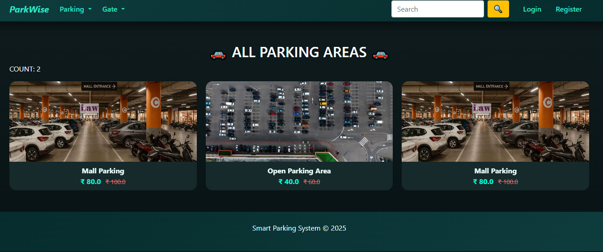
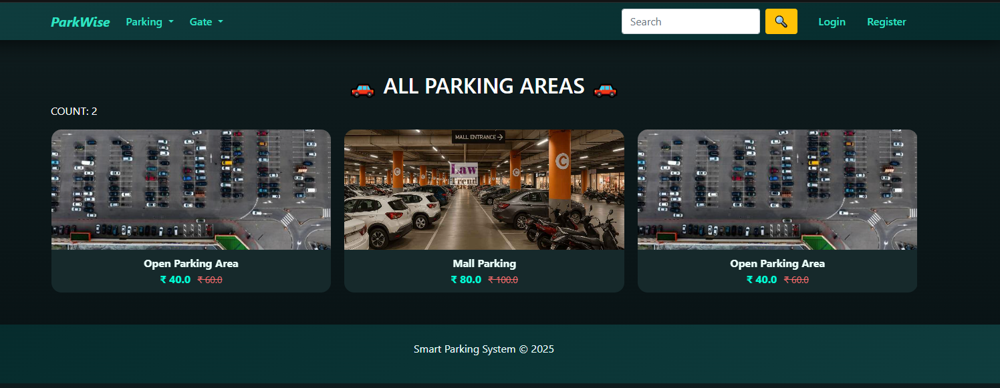
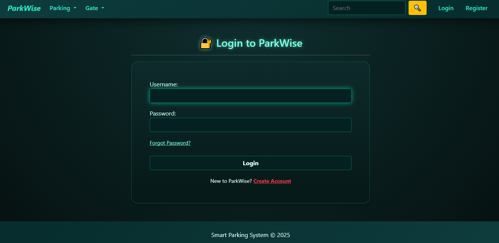
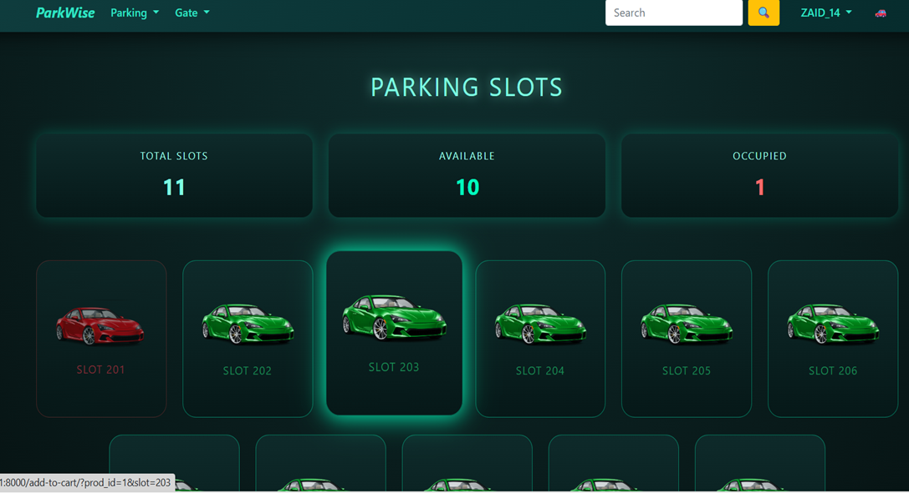
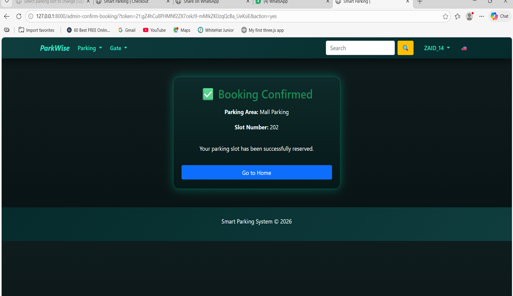
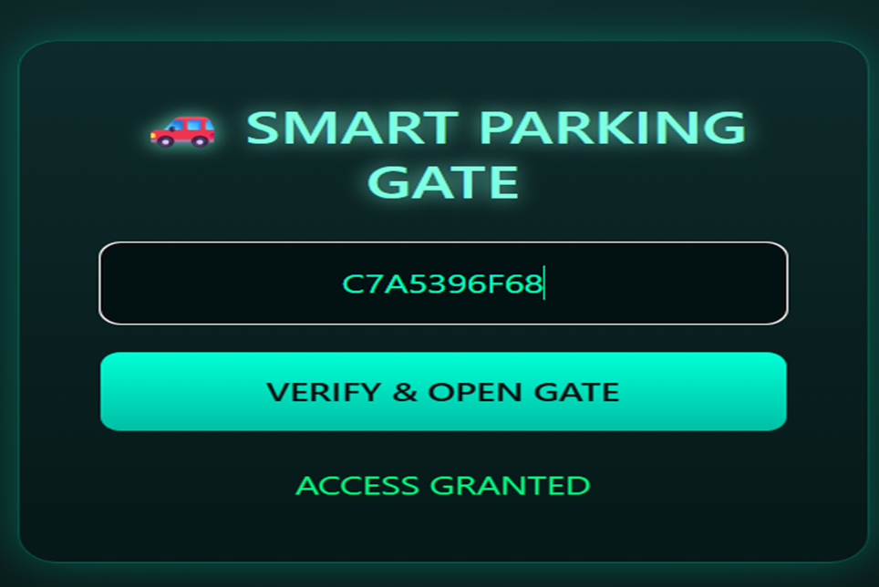
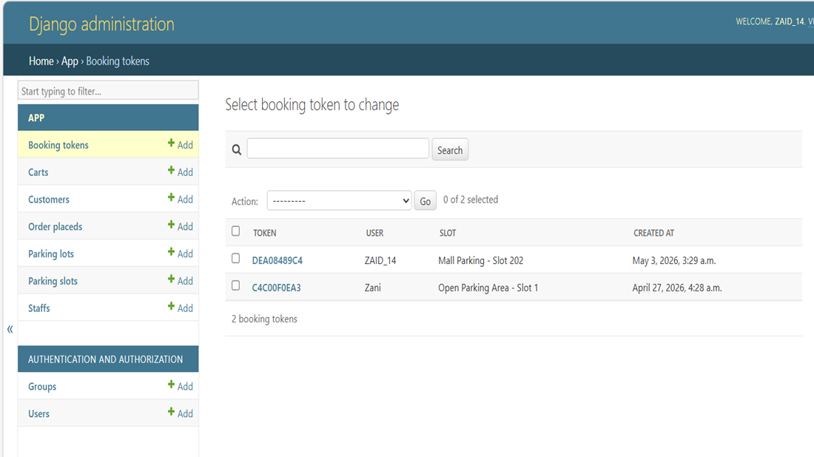

# 🚗 Parking Management System

<p align="center">
  
</p>

<p align="center">
A modern Django-based web application for smart parking slot booking and management.
</p>

---

## ✨ Features

- 🔐 User Authentication
- 🚗 Parking Area Management
- 🅿 Smart Slot Booking
- 📱 WhatsApp Booking Confirmation
- 📧 Email Notifications
- 🎫 Booking Token Generation
- 🚧 Smart Parking Gate Verification
- 👤 User Profile Management
- ⚙️ Django Admin Dashboard

---

## 🛠️ Tech Stack

| Technology | Used |
|------------|------|
| Python | ✅ |
| Django | ✅ |
| SQLite | ✅ |
| HTML | ✅ |
| CSS | ✅ |
| JavaScript | ✅ |
| Bootstrap | ✅ |

---

## 📸 Screenshots

### 🏠 Home Page



---

### 🔐 Login Page



---

### 🚗 Parking Areas



---

### ✅ Booking Confirmed



---

### 🚧 Smart Parking Gate



---

### ⚙️ Admin Dashboard



---

## 📂 Project Structure

```text
parking-management-system/
│
├── app/
├── media/
├── screenshots/
├── soloRising/
├── manage.py
├── requirements.txt
└── README.md
```

---

## 🚀 Installation

```bash
git clone https://github.com/ZaidShaikh-2005/parking-management-system.git

cd parking-management-system

pip install -r requirements.txt

python manage.py migrate

python manage.py runserver
```

---

## 🚀 Future Enhancements

- 💳 Online Payment Gateway
- 📱 Mobile Application
- 📡 IoT Sensor Integration
- 📷 QR Code Based Entry
- 🤖 AI-Based Parking Prediction
- 📊 Advanced Analytics Dashboard

---

## 👨‍💻 Developer

**Zaid Shaikh**

GitHub: https://github.com/ZaidShaikh-2005

---

## ⭐ Support

If you found this project useful, please consider giving it a ⭐ on GitHub.